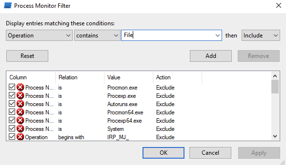

# Basic Dynamic Analysis

Dynamic analysis is a critical phase in malware analysis that involves executing a malware sample in a controlled environment to observe its behavior. This real-time examination allows analysts to uncover the malware's functionalities, interactions, and potential impacts on a system. Basic dynamic analysis is essential for understanding the runtime behavior of a malware specimen.

To conduct basic dynamic analysis, several tools are employed to capture and analyze various aspects of the malware's activity. InetSim is utilized to simulate network services, Wireshark is employed for network traffic inspection, and Procmon monitors system-level activities. This combination of tools enables analysts to gain insights into network communication, file interactions, and system-level events during the execution of the malware, aiding in the identification and mitigation of potential threats.

## InetSim

InetSim is a versatile tool designed for simulating various internet services in a controlled environment. During dynamic analysis, InetSim emulates services such as HTTP, HTTPS, DNS, and more, allowing analysts to observe how malware interacts with these services without connecting to the actual internet. This simulation helps uncover the malware's network behavior, communication patterns, and potential malicious activities, providing valuable insights for further analysis and mitigation efforts.

To run InetSim, open the terminal on REMnux and execute the command `inetsim`. Successful execution should result in the following output:

```plaintext
remnux@ubuntu2004:~$ inetsim
INetSim 1.3.2 (2020-05-19) by Matthias Eckert & Thomas Hungenberg
Using log directory:      /var/log/inetsim/
Using data directory:     /var/lib/inetsim/
Using report directory:   /var/log/inetsim/report/
Using configuration file: /etc/inetsim/inetsim.conf
Parsing configuration file.
Configuration file parsed successfully.
=== INetSim main process started (PID 2117) ===
Session ID:     2117
Listening on:   10.0.0.3
Real Date/Time: 2023-12-08 13:43:46
Fake Date/Time: 2023-12-08 13:43:46 (Delta: 0 seconds)
 Forking services...
  * dns_53_tcp_udp - started (PID 2121)
  * https_443_tcp - started (PID 2123)
  * irc_6667_tcp - started (PID 2130)
  * http_80_tcp - started (PID 2122)
  * ntp_123_udp - started (PID 2131)
  * ftps_990_tcp - started (PID 2129)
  * smtp_25_tcp - started (PID 2124)
  * pop3_110_tcp - started (PID 2126)
  * smtps_465_tcp - started (PID 2125)
  * pop3s_995_tcp - started (PID 2127)
  * ftp_21_tcp - started (PID 2128)
 done.
Simulation running.
```

Ensure that DNS simulation is also active. If not, modify the InetSim configuration accordingly to include DNS simulation for comprehensive dynamic analysis.

## Wireshark

Wireshark is a network protocol analyzer essential for dynamic analysis. It captures and scrutinizes network traffic, offering analysts valuable insights into the communication patterns between a system and the network during malware execution. With its user-friendly interface and robust features, Wireshark plays a key role in identifying unusual or malicious network behaviors, contributing to a better understanding of potential threats in real-time.

<!---- network interface...-->

You can start Wireshark on Remnux with the command:
```
sudo wireshark
```
You can start Wireshark on Flare from the start menu or the folder C:\Users\flare\Desktop\Tools\Networking

1. Choose the Networkinterface wich you want to observe
2. Start capturing
3. You can set filters to filter for specific indicators


<!---You can start Wireshark on Flare from the start menu or the folder C:\Users\flare\Desktop\Tools\Networking

-->


## Procmon

Process Monitor is a tool from Windows Sysinternals, part of the Microsoft TechNet website. The tool monitors and displays in real-time all file system activity on a Microsoft Windows or Unix-like operating system. It combines two older tools, FileMon and RegMon and is used in system administration, computer forensics, and application debugging. Process Monitor monitors and records all actions attempted against the Microsoft Windows Registry. Process Monitor can be used to detect failed attempts to read and write registry keys. It also allows for filtering on specific keys, processes, process IDs, and values. In addition it shows how applications use files and DLLs, detects some critical errors in system files and more.

The most powerfull feature is the filter


Following some examples of usefull filters:

Search for processes of the malware with the name of the malware


Search for file creation/deletion/modifications


Search for Floss extracted strings
