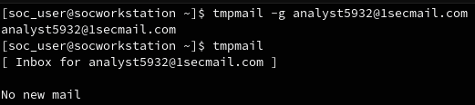
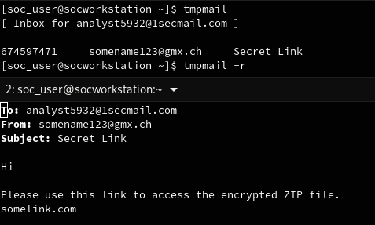
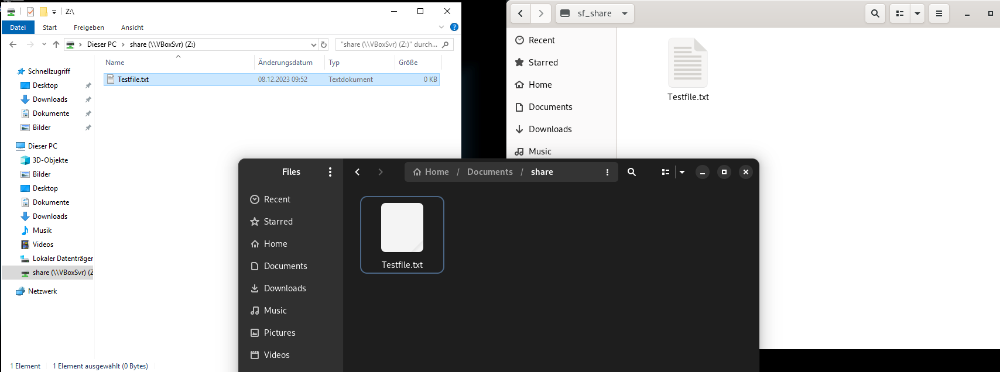

# Basic Information

{: .warning}
## Danger Warning
When handling dangerous files during malware analysis, it is crucial to understand the risks involved. Always use isolated environments and follow established security protocols. Ensure that you have the necessary expertise, and take appropriate precautions to prevent unintended consequences.

## Ensure there is no Internet Connection

To enhance security, ensure that your virtual machine has no internet connection. You can achieve this by running the following command, while the VM is powered off:

```bash
VBoxManage modifyvm YourVMName --nic1 none
```

Verify the absence of internet connectivity by attempting to ping external addresses, such as 8.8.8.8, from within the virtual machine. Additionally, check if you could ping the host machine to confirm the isolation.

## Sharing Files with the Workstation

When sharing files with the workstation, it's essential to follow secure practices. If using file-sharing services or any other means to transfer files, consider the following steps:

1. **Zip the File:**
   Always zip the file that needs to be analyzed before sharing. This step helps to organize and compress the data for efficient transfer.

2. **Encryption:**
   Encrypt the zip file with a password to prevent accidental use and consider using a standard password like "infected" for consistency.

3. **Secure Transmission:**
   Ensure that the file is transmitted securely. For secure transfer options consider the following options:

### USB Sticks

Use USB sticks to transfer files between the analysis environment and the workstation. Ensure that the USB stick is free from any sensitive information and malware.

### File-sharing Services

While using file-sharing services, exercise caution not to upload actual malware. If needed, use encrypted zip files for additional security.

### Temporary Mail Client

The SOC Workstation includes a temporary mail client for communication purposes. This client is solely intended for sharing links with the workstation and not for transmitting actual files. To generate a new temporary email address, use the following command:

```bash
tmpmail -g NAME@1secmail.com
```



By executing the `tmpmail` command, you can view the current inbox, and using `tmpmail -r` allows you to read the most recent message.



Please note that after downloading the file from the File Share, ensure its immediate deletion. As the temporary mail client can be accessed by anyone who knows the generated email address, it is crucial to follow secure file-sharing practices. Consider using reputable sharing services that offer features such as download tracking and prevention of multiple downloads for enhanced security.

## Sharing Files with the VM

Utilize VirtualBox's Shared Folder feature to conveniently share files between the host and virtual machines.
With the provided VMs it should be configured that the folder `/home/soc_user/Documents/share` is shared across all machines:



## Reporting

Document your findings and analysis results thoroughly to support incident response efforts. A comprehensive report should include:

- Summary: Provide a concise summary of the malware's behavior and characteristics.
- Artifacts: Include any artifacts or indicators of compromise (IoCs) discovered during the analysis.
- Mitigations: Suggest potential mitigations or actions to address the identified security risks.

## Cleanup

It is advisable not to reuse analysis virtual machines. After completing the analysis, perform thorough cleanup procedures to eliminate any traces of the malware and ensure a clean environment for future analyses.

Consider the following cleanup steps:

- Snapshot Revert: If you used virtual machine snapshots, revert to a clean snapshot taken before the analysis.
- File Removal: Remove any files and artifacts related to the malware analysis from the virtual machine.
- Logs and Reports: Delete or securely archive logs and reports generated during the analysis to maintain confidentiality.
- Recreate VMs or entire Workstation

Always prioritize security and compliance when handling malware-related data and ensure that your analysis environment follows industry best practices.
