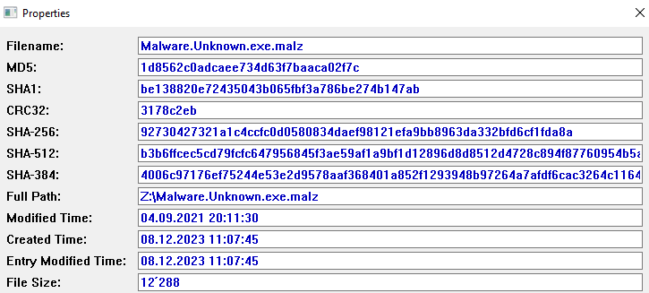

# Basic Static Analysis

Static analysis is a fundamental step in the malware analysis process that involves examining a file without executing it. This chapter focuses on the essential techniques of basic static analysis to gain insights into the characteristics and potential risks posed by a malware sample.

Key aspects of basic static analysis include examining file properties such as size, file type, and metadata, as well as analyzing the code and structure without running the malware. Understanding these foundational concepts is crucial for building a solid foundation in malware analysis, enabling analysts to identify patterns, signatures, and potential indicators of compromise. Throughout this chapter, we'll explore various tools and methodologies to perform basic static analysis effectively and enhance the overall understanding of the analyzed malware.

In this chapter, we will use the following example file: [Malware.Unknown.exe.malz](https://github.com/HuskyHacks/PMAT-labs/tree/main/labs/1-1.BasicStaticAnalysis/Malware.Unknown.exe.malz)

## Hashes

A hash value is a fixed-size numerical representation generated by a hash function, commonly used in malware analysis to uniquely identify files based on their content.

### How to get Hashes

To obtain hash values of a file use the command `sha256sum FILENAME` (or replace sha256sum with the desired algorithm).
FlareVM also provides an application called "HashMyFiles" for this task:




### Compare Hashes

Comparing hashes with online services like VirusTotal can provide valuable information about the file's reputation.
This file for example gets the following score:


## Strings & FLOSS

When analyzing a binary, it's often crucial to extract strings embedded within it. These strings can provide insights into the functionality, behavior, and potential malicious activities of the binary. The process of extracting strings can be accomplished without executing the application.

Two common tools for extracting strings from binaries are `strings` and `FLOSS`. While `strings` is a straightforward tool that extracts human-readable strings, `FLOSS` goes a step further by attempting to decode and deobfuscate these strings.

In the SOC Workstation VM, `FLOSS` is preinstalled, making it readily available for analysis. You can run `FLOSS` using the following command:

```bash
floss -n8 FILENAME
```

The optional -n 8 parameter is not necessarily required, but including it ensures that only strings that are at least 8 characters long are included in the analysis. This approach can provide a more focused overview.

When using the command on the example file the following interesting strings could be found:

```plaintext
URLDownloadToFileW
cmd.exe /C ping 1.1.1.1 -n 1 -w 3000 > Nul & Del /f /q "%s"
http://ssl-6582datamanager.helpdeskbros.local/favicon.ico
C:\Users\Public\Documents\CR433101.dat.exe
Mozilla/5.0
http://huskyhacks.dev
ping 1.1.1.1 -n 1 -w 3000 > Nul & C:\Users\Public\Documents\CR433101.dat.exe
```

Those strings could also just be there to misslead the analyst and that is why this info needs to be handled with caution.

## Import Address Table

- PEView
- Windows API

## PEStudio

## Resources

### MalAPI

<https://malapi.io/>
