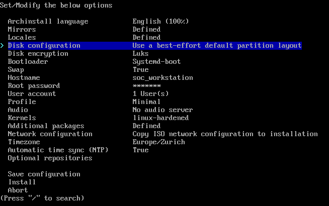
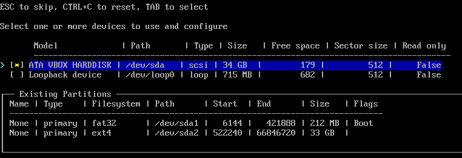
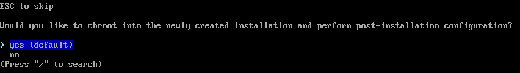

# Arch Installation

<details open markdown="block">
  <summary>
    Table of contents
  </summary>
  {: .text-delta }
- TOC
{:toc}
</details>

---

## Preparation

### Set Keyboard Layout

Before proceeding, set the desired keyboard layout. In this example, we use Swiss German.

``` bash
loadkeys de_CH-latin1
```

{: .highlight}
Note: The symbols '-' and '\_' are located on the right side of the '0' button (use Shift for '\_')

List available Layouts:

``` bash
localectl list-keymaps
```

### Set up internet connection

To establish a WLAN connection, use iwctl and connect to a network. Follow these steps:

1. Run `iwctl` and execute `station list` to list the available WLAN interfaces:

To setup a WLAN connection run `iwctl` and connect to a network.
Run `station list` to list the available wlan interfaces:

```bash
Devices in Station Mode
----------------------------------------------------
Name      State          Scanning
----------------------------------------------------
wlan0     disconnected

```

2. Show available networks with: `station INTERFACENAME get-networks`
3. Connect to a network with: `station INTERFACE_NAME connect SSID`
4. Exit `iwctl` with `exit`

Check if the connection works:

``` bash
ping 8.8.8.8 -c 4
```

### Prepare archinstall

Check the archinstall version:

``` bash
archinstall -v
```

Tested versions:

- 2.6.3
- 2.7.1

If your archinstall version is older, run the following command to update:

``` bash
pacman -Sy archinstall
```

### Install git

``` bash
pacman -Sy git
```

---

## Installation

### Get Configuration

Clone the repository:

``` bash
git clone https://github.com/stretfordStart/soc_workstation
```

### Run Archinstall with Predefined Configuration

Execute the following command to run archinstall with the predefined configuration:

``` bash
archinstall --config soc_workstation/configuration.json --creds soc_workstation/credentials.json
```

If your configuration has been tested on this device and requires no further adjustments, you can speed up the process with silent mode:

``` bash
archinstall --config soc_workstation/configuration.json --creds soc_workstation/credentials.json --silent
```

The following screen should appear after running archinstall in normal mode:


With the default config the follwing settings are set:

| Description | Setting |
|:------------|:--------|
| Language| English |
| Download Mirrors | Swiss |
| Locales | Swiss |
| Disk Configuration | Set for 512 GB NVME SSD |
| Disk Encrpytion | Yes |
| Boot Manager | Grub2 |
| Swap | Yes |
| Hostname | soc_workstation |
| Root password | malware |
| Additional User | soc_user |
| Additional User password | malware |
| Additional User sudo privileges | Yes |
| Desktop environment | None |
| Audio drivers | None |
| Kernel | linux-hardenend |
| Additional packages | curl, dnsmasq, duf, eog, firefox, flameshot, gdm, git, gnome-control-center, gnome-menus, gnome-settings-daemon, gnome-shell, gnome-shell-extensions, gnome-text-editor, gnome-tweaks, jq, linux-hardened-headers, nautilus, orca, tilix, vagrant, vim, virtualbox, virtualbox-host-dkms, w3m, wget, xclip, xdg-desktop-portal-gnome, xdg-user-dirs-gtk |
| Network settings | Copy current |
| Timezone | "Europe/Zurich" |

{: .highlight}
Note: The disk configuration often requires changes. For simplicity, the best-effort partition layout is recommended.
Choose the disk where the operating system should be installed:


Please be aware that disk encryption needs to be set up again after changing the disk configuration.

If you are satisfied with these settings, proceed.

{: .warning}
If not declared otherwise, the entire disk gets wiped!

Choose "Install" to start the installation. This process can take up to 10 minutes, depending on your internet connection and hardware.
Once the installation is completed, there is an option to chroot into the new system. Since the post-install steps are all done within the desktop environment, there is no need for this. Choose "No" and reboot the system, ensuring to remove the installation media.


## Known Issues

### Invalid Keys when Running pacman

If the command pacman -Sy fails due to an invalid key, initialize it with:

```bash
pacman-key --init
```
