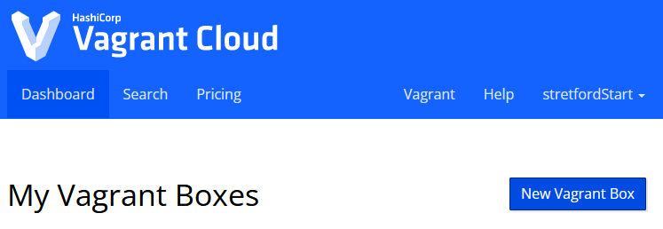
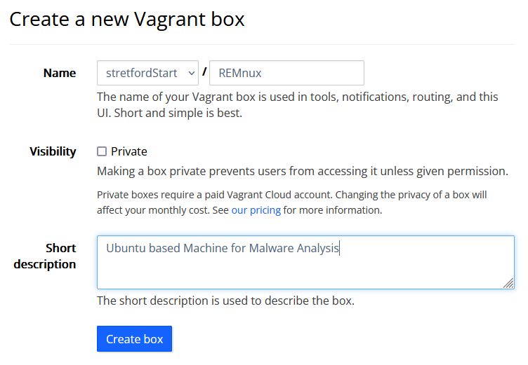
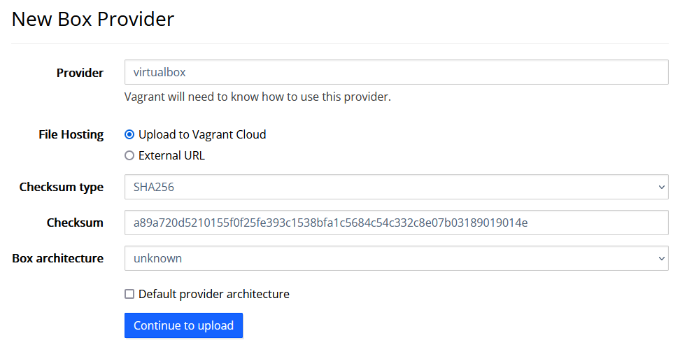

# Upload Box

  

    Table of contents
  

  {: .text-delta }
- TOC
{:toc}

---

## Upload Box to Vagrant Cloud

Follow these steps to upload a Vagrant Box to Vagrant Cloud.

1. Go to [Vagrant Cloud](https://app.vagrantup.com) and login
2. Click "Dashboard" and then "New Vagrant Box" button

3. Enter name, visibility and description and click "Create box"

4. Enter a version (use [RubyGems versioning](https://guides.rubygems.org/patterns/#semantic-versioning))
5. Click "Add a provider", where you will be lead to a page where you can upload your box
6. Enter the provider (=virtualbox), and choose SHA256 as the Checksum type
7. Enter the SHA256 Checksum of the .box file
8. Use the Box architecture "unknown"
9. Upload the .box File

