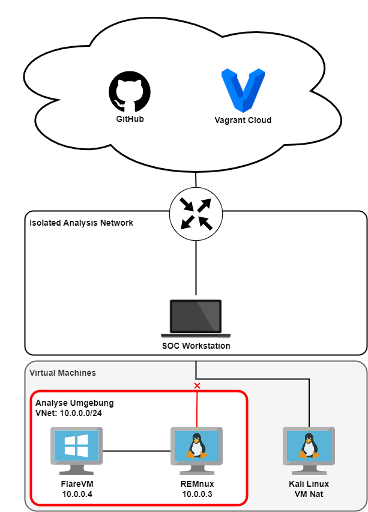

This site contains the documentation for the GitHub project [SOC Workstation](https://github.com/stretfordStart/soc_workstation).
The primary focus of the project is to automate the process of setting up a secure system where you can analyse malware.
In summary the Workstation uses Linux Arch as Host system and multiple VMs for Malware Analysis and other SOC tasks.

The Workstation is meant to be operated in a dedicated Analysis Network in order to stay safe. The Virtual Machines used for Analysis purposes
should use an internal Network to deny potential Malware access to the internet. In order to still monitor Network Calls, InetSim is utilised on REMnux.
The Setup after running the Installation as described here should look like that:

